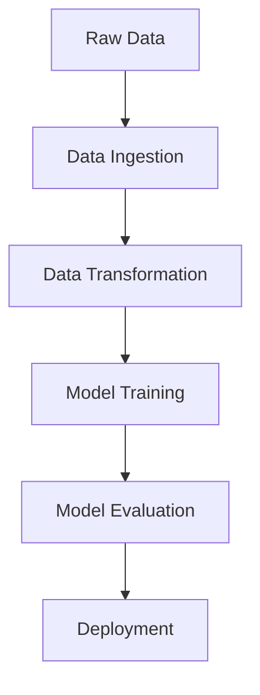

# Phishing_classifier_2

### 2nd project in series of 100 End to End Projects.


## Overview
Phishing Website Classifier is a machine learning application designed to identify and classify websites as either phishing or legitimate. It uses structured data and a robust feature set to predict the likelihood of a website being malicious, helping enhance cybersecurity measures.

## Problem Statement
The objective is to classify websites as either phishing or legitimate based on various attributes. Phishing websites aim to deceive users and steal sensitive information like login credentials or financial data. This project aims to build a model that accurately predicts whether a website is phishing or legitimate, based on features extracted from its URL and web content.

---

## Features
- **Data Ingestion**: Automated loading and preprocessing of website data.
- **Data Transformation**: Feature engineering and data normalization.
- **Model Training**: Building machine learning models for classification.
- **API Integration**: Flask-based REST API for real-time predictions.
- **Deployment**: Containerized using Docker for seamless deployment.

---

## Table of Contents
- [Overview](#overview)
- [Problem Statement](#problem-statement)
- [Features](#features)
- [Dataset Description](#dataset-description)
- [Tech Stack](#tech-stack)
- [Setup Instructions](#setup-instructions)
- [Deployment Guide](#deployment-guide)
- [How to Run the Model](#how-to-run-the-model)
- [Visual Overview](#visual-overview)
- [Contributing](#contributing)
- [License](#license)

---

## Dataset Description

### **Features**:
The dataset contains the following attributes for 11,055 website records:
- **Binary Attributes** (e.g., `-1` = No, `1` = Yes):  
  - `having_IP_Address`, `Shortining_Service`, `having_At_Symbol`, etc.
- **Numerical Features**:  
  - `URL_Length`, `Domain_registeration_length`, `age_of_domain`.
- **Target Variable**:  
  - `Result` (`-1` = Phishing, `1` = Legitimate).

For a detailed description, refer to the [Dataset Documentation](#).

---

## Tech Stack

| Tool | Purpose |
|------|---------|
| **Python** | Core programming language |
| **Pandas & NumPy** | Data processing |
| **Scikit-learn** | Model training |
| **Flask** | API development |
| **Docker** | Containerization |
| **AWS S3** | Data storage |
| **GitHub Actions** | CI/CD pipelines |

---

## Setup Instructions

1. **Clone the Repository:**
   ```
   git clone https://github.com/Govindkv/Phishing_classifier_2.git
   cd Phishing_classifier_2
   ```

2. **Create a Virtual Environment:**
   ```
   python -m venv venv
   source venv/bin/activate  # On Windows: venv\Scripts\activate
   ```

3. **Install Dependencies:**
   ```
   pip install -r requirements.txt
   ```

4. **Prepare the Dataset:**
   - Place the dataset in the `data/` folder.
   - Update the configuration file for dataset paths.

---

## Deployment Guide

1. **Docker Build and Run:**
   ```
   docker build -t phishing-website-classifier .
   docker run -p 5000:5000 phishing-website-classifier
   ```

2. **Cloud Deployment:**
   - Deploy using AWS Elastic Beanstalk or Azure App Services.
   - Push Docker images to a container registry like Docker Hub or AWS ECR.

---

## How to Run the Model

1. **Start the Application:**
   ```
   python app.py
   ```

2. **Access Endpoints:**
   - **Home Page:** `http://127.0.0.1:5000/`
   - **Training Pipeline:** `http://127.0.0.1:5000/train`
   - **Prediction Pipeline:** `http://127.0.0.1:5000/predict`

3. **Prediction Steps:**
   - Use the `/predict` endpoint to upload a file for predictions:
     ```
     curl -X POST -F 'file=@path_to_your_file.csv' http://127.0.0.1:5000/predict
     ```

---

## Visual Overview

### Data Pipeline


### Key Tools
- 
- 
- 
- 

---

## Contributing

Feel free to contribute by:
- Reporting issues or bugs.
- Suggesting new features or enhancements.
- Submitting pull requests to improve the project.

For more details, refer to the [Contributing Guidelines](#).

---

## License
This project is licensed under the MIT License. See the [LICENSE](#) file for details.